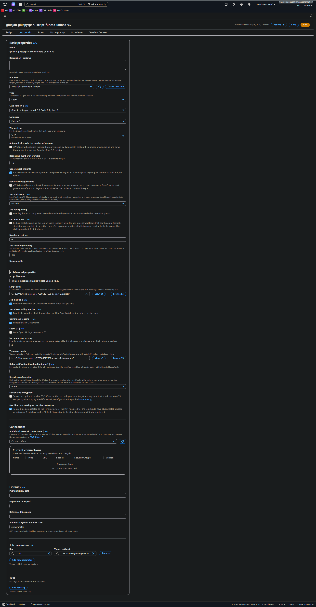

## **Diretórios S3**
~~~~plaintext
bukt-amzn-s3-self/
├── code/
│   └── scripts_sql/
│       ├── tbl_cnpj_premium_vol_pag_3m.sql
│       ├── tbl_cpf_vol_pag_3m.sql
│       ├── tbl_csld_qtd_clie_variacao_mom_vol_pag_3m.sql
│       ├── temp_1_tbl_refined_vendas_pj_middle.sql
│       ├── temp_2_tbl_refined_vendas_pj_middle.sql
│       └── temp_3_tbl_refined_vendas_final.sql
├── layer_raw/
│   ├── car_sales_analysis_dataset/
│   │   └── car_sales_analysis_dataset.csv
│   └── dados_sinteticos_fn/
│       └── dados_sinteticos_fn_20260509.csv
└── layer_refined/
    └── data/
        ├── athena-query-results/  <-- (Logs de execução do Athena)
        ├── tbl_cnpj_premium_vol_pag_3m_v3/
        ├── tbl_cpf_vol_pag_3m_v3/
        └── tbl_csld_qtd_clie_variacao_mom_vol_pag_3m_v3/
~~~~

## **JSON da Máquina de Estado**
~~~~json
{
  "Comment": "Pipeline paralelo com consolidação final em modo single e partição opcional",
  "StartAt": "Execucao_Paralela_Fila",
  "States": {
    "Execucao_Paralela_Fila": {
      "Type": "Parallel",
      "Next": "Glue_Consolidacao_Final",
      "Branches": [
        {
          "StartAt": "Job_Processamento_PF_PessoaFisica",
          "States": {
            "Job_Processamento_PF_PessoaFisica": {
              "Type": "Task",
              "Resource": "arn:aws:states:::glue:startJobRun.sync",
              "Arguments": {
                "JobName": "gluejob-gluepyspark-script-funcao-unload-v3",
                "Arguments": {
                  "--bucket": "bukt-amzn-s3-self",
                  "--database": "database_workspace_db",
                  "--workgroup": "primary",
                  "--base_dir": "layer_refined/data",
                  "--tmp_dir": "layer_refined/data/tmp",
                  "--path_query_sql": "s3://bukt-amzn-s3-self/code/scripts_sql/tbl_cpf_vol_pag_3m.sql",
                  "--table_name": "tbl_cpf_vol_pag_3m_v3",
                  "--list_anomes_processar": "202501,202502,202503,202504,202505,202506,202507,202508,202509,202510,202511,202512",
                  "--execution_mode": "BATCH",
                  "--partition_col": "anomes"
                }
              },
              "End": true
            }
          }
        },
        {
          "StartAt": "Job_Processamento_PJ_Premium",
          "States": {
            "Job_Processamento_PJ_Premium": {
              "Type": "Task",
              "Resource": "arn:aws:states:::glue:startJobRun.sync",
              "Arguments": {
                "JobName": "gluejob-gluepyspark-script-funcao-unload-v3",
                "Arguments": {
                  "--bucket": "bukt-amzn-s3-self",
                  "--database": "database_workspace_db",
                  "--workgroup": "primary",
                  "--base_dir": "layer_refined/data",
                  "--tmp_dir": "layer_refined/data/tmp",
                  "--path_query_sql": "s3://bukt-amzn-s3-self/code/scripts_sql/tbl_cnpj_premium_vol_pag_3m.sql",
                  "--table_name": "tbl_cnpj_premium_vol_pag_3m_v3",
                  "--list_anomes_processar": "202501,202502,202503,202504,202505,202506,202507,202508,202509,202510,202511,202512",
                  "--execution_mode": "BATCH",
                  "--partition_col": "anomes"
                }
              },
              "End": true
            }
          }
        }
      ]
    },
    "Glue_Consolidacao_Final": {
      "Type": "Task",
      "Resource": "arn:aws:states:::glue:startJobRun.sync",
      "Arguments": {
        "JobName": "gluejob-gluepyspark-script-funcao-unload-v3",
        "Arguments": {
          "--bucket": "bukt-amzn-s3-self",
          "--database": "database_workspace_db",
          "--workgroup": "primary",
          "--base_dir": "layer_refined/data",
          "--tmp_dir": "layer_refined/data/tmp",
          "--path_query_sql": "s3://bukt-amzn-s3-self/code/scripts_sql/tbl_csld_qtd_clie_variacao_mom_vol_pag_3m.sql",
          "--table_name": "tbl_csld_qtd_clie_variacao_mom_vol_pag_3m_v3",
          "--execution_mode": "SINGLE",
          "--partition_col": "anomes"
        }
      },
      "End": true
    }
  },
  "QueryLanguage": "JSONata"
}
~~~~

## **Glue Job**

### Script PySpark
~~~~python
import logging
import sys
import time
import uuid
from datetime import datetime
from typing import Callable, List, Optional

import boto3
from dateutil.relativedelta import relativedelta
from pyspark.sql import DataFrame, SparkSession
from awsglue.utils import getResolvedOptions

# =============================================================================
# CONFIGURAÇÕES GLOBAIS
# =============================================================================

# Ajuste a região se o seu ambiente mudar.
# O bucket, o Glue e o Athena devem estar alinhados na mesma região.
AWS_REGION = "us-east-2"

# Configuração de logging para uso em produção.
logging.basicConfig(
    level=logging.INFO,
    format="%(asctime)s | %(levelname)s | %(name)s | %(message)s"
)
logger = logging.getLogger("gluejob_gluepyspark_script_funcao_unload")

# Client S3 reutilizável.
s3 = boto3.client("s3", region_name=AWS_REGION)

# =============================================================================
# 1. FUNÇÕES DE INFRAESTRUTURA E HELPER
# =============================================================================

def get_spark_session(app_name: str = "Orquestracao_Athena_Spark") -> SparkSession:
    """
    Cria e retorna uma SparkSession com ajustes úteis para workloads Glue/S3.

    Melhorias aplicadas:
    - adaptive execution habilitada;
    - número de shuffle partitions padronizado;
    - uso de S3A sem endpoint hardcoded por região, evitando redirect 301.

    Returns:
        SparkSession configurada para execução em Glue/Spark.
    """
    return (
        SparkSession.builder
        .appName(app_name)
        .config("spark.sql.sources.partitionOverwriteMode", "dynamic")
        .config("spark.sql.adaptive.enabled", "true")
        .config("spark.sql.shuffle.partitions", "200")
        .config("fs.s3a.impl", "org.apache.hadoop.fs.s3a.S3AFileSystem")
        .config("fs.s3a.aws.credentials.provider", "com.amazonaws.auth.DefaultAWSCredentialsProviderChain")
        .config("fs.s3a.create.folder.marker", "false")
        .getOrCreate()
    )

def clean_s3_prefix(bucket_name: str, prefix: str, region: str = AWS_REGION) -> None:
    """
    Remove todos os objetos de um prefixo S3.

    A limpeza deve ser executada apenas após o processamento completo do job.
    Se o job falhar no meio do caminho, o prefixo temporário é preservado
    para diagnóstico e reprocessamento.

    Args:
        bucket_name: Nome do bucket S3.
        prefix: Prefixo a ser removido.
        region: Região do bucket.

    Returns:
        None
    """
    logger.info("Limpando diretório temporário S3: s3://%s/%s", bucket_name, prefix)
    s3_resource = boto3.resource("s3", region_name=region)
    bucket = s3_resource.Bucket(bucket_name)
    bucket.objects.filter(Prefix=prefix).delete()
    logger.info("Limpeza concluída.")

def parse_s3_uri(s3_uri: str) -> tuple[str, str]:
    """
    Converte uma URI no formato s3://bucket/key em (bucket, key).

    Args:
        s3_uri: URI S3 a ser parseada.

    Returns:
        Tupla com (bucket, key).

    Raises:
        ValueError: se a URI não estiver no formato esperado.
    """
    if not s3_uri.startswith("s3://"):
        raise ValueError("Use uma URI no formato s3://bucket/key")

    bucket_key = s3_uri[5:]
    bucket, key = bucket_key.split("/", 1)
    return bucket, key

def read_sql_from_s3(s3_uri: str) -> str:
    """
    Lê um arquivo SQL salvo no S3 e devolve o conteúdo como string.

    Esta função é usada uma única vez no início do job para evitar leituras
    repetidas do mesmo arquivo a cada iteração.

    Args:
        s3_uri: URI do arquivo SQL no S3.

    Returns:
        Conteúdo do arquivo SQL como string.
    """
    bucket, key = parse_s3_uri(s3_uri)
    obj = s3.get_object(Bucket=bucket, Key=key)
    return obj["Body"].read().decode("utf-8").strip()

def shift_anomes(anomes: int, months: int) -> int:
    """
    Calcula um anomes deslocado em relação ao anomes base.

    Exemplo:
        shift_anomes(202501, -1) -> 202412

    Args:
        anomes: Referência no formato YYYYMM.
        months: Deslocamento em meses.

    Returns:
        Novo anomes no formato YYYYMM.
    """
    return int(
        (datetime.strptime(str(anomes), "%Y%m") + relativedelta(months=months)).strftime("%Y%m")
    )

def s3_prefix_has_data(s3_uri_prefix: str) -> bool:
    """
    Verifica se existe ao menos um objeto no prefixo S3 informado.

    Isso evita tentar ler um path Parquet inexistente após o UNLOAD do Athena.

    Args:
        s3_uri_prefix: Prefixo S3 a ser validado.

    Returns:
        True se houver pelo menos um objeto no prefixo; caso contrário, False.
    """
    bucket, key_prefix = parse_s3_uri(s3_uri_prefix)

    response = s3.list_objects_v2(
        Bucket=bucket,
        Prefix=key_prefix,
        MaxKeys=1
    )
    return "Contents" in response

def get_optional_cli_arg(name: str, default: Optional[str] = None) -> Optional[str]:
    """
    Lê argumento opcional da linha de comando no padrão Glue/Step Functions:

        --nome_do_parametro valor

    Essa função permite que o script suporte parâmetros opcionais sem quebrar
    o getResolvedOptions, que exige apenas argumentos obrigatórios.

    Args:
        name: Nome do argumento sem os dois hífens.
        default: Valor padrão caso o argumento não exista.

    Returns:
        O valor do argumento ou o default.
    """
    flag = f"--{name}"
    if flag in sys.argv:
        idx = sys.argv.index(flag)
        if idx + 1 < len(sys.argv) and not sys.argv[idx + 1].startswith("--"):
            return sys.argv[idx + 1]
    return default

def format_sql_partition_literal(value: str) -> str:
    """
    Formata um valor para uso seguro em SQL de partição.

    Se o valor for numérico, retorna sem aspas.
    Se for texto, retorna entre aspas simples.

    Args:
        value: Valor da partição.

    Returns:
        Literal SQL apropriado para uso em ALTER TABLE ... PARTITION.
    """
    if value.isdigit() or (value.startswith("-") and value[1:].isdigit()):
        return value
    return "'" + value.replace("'", "''") + "'"

# =============================================================================
# 2. FUNÇÕES CORE DO PIPELINE (ATHENA E GLUE)
# =============================================================================

def execute_athena_unload_to_df(
    query: str,
    database: str,
    s3_unload_path: str,
    s3_athena_results_path: str,
    workgroup: str,
    spark: SparkSession,
    athena_client,
    poll_interval: int = 5
) -> DataFrame:
    """
    Executa uma query no Athena via UNLOAD, salva o resultado em Parquet/Snappy
    no S3 e retorna um DataFrame Spark.

    Fluxo:
        1. Monta a instrução UNLOAD;
        2. Dispara a query no Athena;
        3. Faz polling até o término;
        4. Valida se o Athena realmente materializou arquivos no S3;
        5. Lê o Parquet com Spark.

    Args:
        query: SQL a ser executada no Athena.
        database: Database do Athena.
        s3_unload_path: Prefixo S3 de saída do UNLOAD.
        s3_athena_results_path: Prefixo S3 para resultados internos do Athena.
        workgroup: Workgroup do Athena.
        spark: SparkSession ativa.
        athena_client: Cliente boto3 do Athena.
        poll_interval: Intervalo entre verificações de status.

    Returns:
        DataFrame Spark com o resultado do UNLOAD.

    Raises:
        RuntimeError: se a query falhar, for cancelada ou não gerar output no S3.
    """
    if not s3_unload_path.endswith("/"):
        s3_unload_path += "/"

    unload_query = f"""
    UNLOAD (
        {query}
    )
    TO '{s3_unload_path}'
    WITH ( format = 'PARQUET', compression = 'SNAPPY' )
    """

    logger.info("Disparando UNLOAD no Athena. Destino: %s", s3_unload_path)

    resp = athena_client.start_query_execution(
        QueryString=unload_query,
        QueryExecutionContext={"Database": database},
        ResultConfiguration={"OutputLocation": s3_athena_results_path},
        WorkGroup=workgroup
    )
    qid = resp["QueryExecutionId"]
    logger.info("QueryExecutionId: %s", qid)

    # Aguarda a conclusão (Polling)
    while True:
        status_resp = athena_client.get_query_execution(QueryExecutionId=qid)
        status = status_resp["QueryExecution"]["Status"]["State"]

        if status == "SUCCEEDED":
            break

        if status in ("FAILED", "CANCELLED"):
            reason = status_resp["QueryExecution"]["Status"].get(
                "StateChangeReason",
                "Erro desconhecido"
            )
            raise RuntimeError(
                f"Athena query {qid} falhou. Status: {status}. Motivo: {reason}"
            )

        time.sleep(poll_interval)

    # Validação do output: evita PATH_NOT_FOUND no Spark se o UNLOAD não gerou arquivos.
    if not s3_prefix_has_data(s3_unload_path):
        raise RuntimeError(
            f"O UNLOAD foi concluído, mas nenhum arquivo foi encontrado em {s3_unload_path}"
        )

    # Lê os dados gerados via PySpark
    spark_read_path = s3_unload_path.replace("s3://", "s3a://")
    logger.info("UNLOAD concluído. Lendo DataFrame Spark em: %s", spark_read_path)

    return spark.read.parquet(spark_read_path)

def upsert_glue_table(
    df: DataFrame,
    spark: SparkSession,
    db_name: str,
    table_name: str,
    s3_catalog_base_path: str,
    s3_spark_base_path: str,
    partition_col: Optional[str] = None,
    partition_val: Optional[str] = None
) -> None:
    """
    Cria ou atualiza a tabela no Glue Catalog.

    Regras:
        - Se partition_col e partition_val forem informados:
            - escreve apenas a partição informada;
            - a partição é sempre sobrescrita;
            - a partição é registrada no Glue Catalog.
        - Se partition_col for informado e partition_val NÃO for informado:
            - escreve a tabela inteira particionada por partition_col;
            - o carregamento continua sendo overwrite.
        - Se partição não for informada:
            - escreve a tabela inteira sem particionamento;
            - o carregamento continua sendo overwrite.

    Args:
        df: DataFrame a ser persistido.
        spark: SparkSession ativa.
        db_name: Database do Glue/Athena.
        table_name: Nome da tabela destino.
        s3_catalog_base_path: Base path S3 da tabela.
        s3_spark_base_path: Base path S3 com esquema s3a:// para gravação direta.
        partition_col: Nome da coluna de partição (opcional).
        partition_val: Valor da partição (opcional).

    Returns:
        None
    """
    full_table_name = f"{db_name}.{table_name}"

    if not s3_catalog_base_path.endswith("/"):
        s3_catalog_base_path += "/"
    if not s3_spark_base_path.endswith("/"):
        s3_spark_base_path += "/"

    table_exists = spark.catalog.tableExists(full_table_name)

    # -------------------------------------------------------------------------
    # MODO COM PARTIÇÃO EXPLÍCITA E VALOR DE PARTIÇÃO
    # -------------------------------------------------------------------------
    if partition_col and partition_val is not None:
        partition_val_str = str(partition_val)
        partition_literal = format_sql_partition_literal(partition_val_str)

        if not table_exists:
            logger.info(
                "Tabela %s não existe. Criando no Glue com partição %s=%s...",
                full_table_name,
                partition_col,
                partition_val_str
            )
            (
                df.write
                .mode("overwrite")
                .format("parquet")
                .partitionBy(partition_col)
                .option("path", s3_catalog_base_path)
                .option("overwriteSchema", "true")
                .saveAsTable(full_table_name)
            )
            logger.info("Tabela criada com sucesso: %s", full_table_name)
            return

        logger.info(
            "Tabela existente. Atualizando partição %s=%s...",
            partition_col,
            partition_val_str
        )

        partition_write_path = f"{s3_spark_base_path}{partition_col}={partition_val_str}/"

        (
            df.write
            .mode("overwrite")
            .parquet(partition_write_path)
        )

        spark.sql(f"""
            ALTER TABLE {full_table_name}
            ADD IF NOT EXISTS PARTITION ({partition_col}={partition_literal})
            LOCATION '{s3_catalog_base_path}{partition_col}={partition_val_str}/'
        """)

        spark.catalog.refreshTable(full_table_name)
        logger.info(
            "Metadados da partição atualizados no Glue: %s=%s",
            partition_col,
            partition_val_str
        )
        return

    # -------------------------------------------------------------------------
    # MODO COM PARTIÇÃO, MAS SEM VALOR: TABLE FULL REBUILD PARTICIONADO
    # -------------------------------------------------------------------------
    if partition_col and partition_val is None:
        if partition_col not in df.columns:
            raise ValueError(
                f"A coluna de partição '{partition_col}' não existe no DataFrame."
            )

        logger.info(
            "Escrita completa particionada por %s com overwrite para a tabela %s",
            partition_col,
            full_table_name
        )

        (
            df.write
            .mode("overwrite")
            .format("parquet")
            .partitionBy(partition_col)
            .option("path", s3_catalog_base_path)
            .option("overwriteSchema", "true")
            .saveAsTable(full_table_name)
        )

        spark.catalog.refreshTable(full_table_name)
        logger.info("Tabela particionada gravada com sucesso: %s", full_table_name)
        return

    # -------------------------------------------------------------------------
    # MODO SEM PARTIÇÃO
    # -------------------------------------------------------------------------
    logger.info("Escrita sem partição para a tabela %s", full_table_name)

    (
        df.write
        .mode("overwrite")
        .format("parquet")
        .option("path", s3_catalog_base_path)
        .option("overwriteSchema", "true")
        .saveAsTable(full_table_name)
    )

    logger.info("Tabela sem partição gravada com sucesso: %s", full_table_name)

# =============================================================================
# 3. ORQUESTRADORES
# =============================================================================

def run_batch_pipeline(
    table_name: str,
    db_name: str,
    query_builder_fn: Callable[[int], str],
    list_anomes: List[int],
    bucket_name: str,
    base_dir: str,
    tmp_dir: str,
    workgroup: str,
    spark: SparkSession,
    athena_client,
    partition_col: str = "anomes"
) -> None:
    """
    Executa o pipeline em modo batch, iterando sobre uma lista de anomes.

    Cada iteração:
        1. gera a query do período;
        2. executa UNLOAD no Athena;
        3. lê o resultado no Spark;
        4. grava a partição no Glue Catalog.

    A limpeza do prefixo temporário ocorre somente ao final do processamento.

    Args:
        table_name: Nome da tabela destino.
        db_name: Database do Glue/Athena.
        query_builder_fn: Função que recebe anomes e retorna SQL.
        list_anomes: Lista de anomes a processar.
        bucket_name: Bucket S3.
        base_dir: Diretório base da camada de saída.
        tmp_dir: Diretório temporário S3.
        workgroup: Workgroup do Athena.
        spark: SparkSession ativa.
        athena_client: Cliente boto3 do Athena.
        partition_col: Nome da coluna de partição.

    Returns:
        None
    """
    logger.info("=======================================================")
    logger.info("INICIANDO PIPELINE BATCH PARA A TABELA: %s.%s", db_name, table_name)
    logger.info("=======================================================")

    s3_catalog_base = f"s3://{bucket_name}/{base_dir}/{table_name}/"
    s3_spark_base = f"s3a://{bucket_name}/{base_dir}/{table_name}/"
    s3_athena_results = f"s3://{bucket_name}/{base_dir}/athena-query-results/"

    table_tmp_prefix = f"{tmp_dir}/{table_name}_{uuid.uuid4().hex[:8]}/"
    s3_athena_unload_base = f"s3://{bucket_name}/{table_tmp_prefix}"

    logger.info("Prefixo temporário da execução: s3://%s/%s", bucket_name, table_tmp_prefix)
    logger.info("Base Athena results: %s", s3_athena_results)

    for anomes in list_anomes:
        logger.info("--- Processando anomes=%s ---", anomes)

        sql_query = query_builder_fn(anomes)
        unload_path = f"{s3_athena_unload_base}anomes={anomes}/"

        logger.info("UNLOAD path para anomes=%s: %s", anomes, unload_path)

        df = execute_athena_unload_to_df(
            query=sql_query,
            database=db_name,
            s3_unload_path=unload_path,
            s3_athena_results_path=s3_athena_results,
            workgroup=workgroup,
            spark=spark,
            athena_client=athena_client
        )

        upsert_glue_table(
            df=df,
            spark=spark,
            db_name=db_name,
            table_name=table_name,
            s3_catalog_base_path=s3_catalog_base,
            s3_spark_base_path=s3_spark_base,
            partition_col=partition_col,
            partition_val=str(anomes)
        )

        try:
            df.unpersist()
        except Exception:
            pass

        del df
        spark.catalog.clearCache()

    logger.info("SUCESSO: Processamento batch da tabela %s concluído.", table_name)
    clean_s3_prefix(bucket_name, table_tmp_prefix)

def run_single_pipeline(
    table_name: str,
    db_name: str,
    query_builder_fn: Callable[[Optional[int]], str],
    bucket_name: str,
    base_dir: str,
    tmp_dir: str,
    workgroup: str,
    spark: SparkSession,
    athena_client,
    partition_col: Optional[str] = None,
    partition_value: Optional[str] = None
) -> None:
    """
    Executa o pipeline em modo single, sem loop.

    Esse modo atende casos em que:
        - a query não possui placeholders;
        - o usuário quer executar apenas uma vez;
        - a partição é opcional.

    Se partition_col e partition_value forem informados, a escrita será por partição
    e a partição será sobrescrita.
    Se apenas partition_col for informado, a tabela inteira será gravada particionada
    por essa coluna, também em overwrite.
    Caso contrário, a tabela será escrita sem partição.

    Args:
        table_name: Nome da tabela destino.
        db_name: Database do Glue/Athena.
        query_builder_fn: Função que retorna a SQL final sem depender de anomes.
        bucket_name: Bucket S3.
        base_dir: Diretório base da camada de saída.
        tmp_dir: Diretório temporário S3.
        workgroup: Workgroup do Athena.
        spark: SparkSession ativa.
        athena_client: Cliente boto3 do Athena.
        partition_col: Nome da coluna de partição (opcional).
        partition_value: Valor da partição (opcional).

    Returns:
        None
    """
    logger.info("=======================================================")
    logger.info("INICIANDO PIPELINE SINGLE PARA A TABELA: %s.%s", db_name, table_name)
    logger.info("=======================================================")

    s3_catalog_base = f"s3://{bucket_name}/{base_dir}/{table_name}/"
    s3_spark_base = f"s3a://{bucket_name}/{base_dir}/{table_name}/"
    s3_athena_results = f"s3://{bucket_name}/{base_dir}/athena-query-results/"

    table_tmp_prefix = f"{tmp_dir}/{table_name}_{uuid.uuid4().hex[:8]}/"
    s3_athena_unload_base = f"s3://{bucket_name}/{table_tmp_prefix}"

    logger.info("Prefixo temporário da execução: s3://%s/%s", bucket_name, table_tmp_prefix)
    logger.info("Base Athena results: %s", s3_athena_results)

    sql_query = query_builder_fn(None)
    unload_path = f"{s3_athena_unload_base}single_run/"

    logger.info("UNLOAD path para execução única: %s", unload_path)

    df = execute_athena_unload_to_df(
        query=sql_query,
        database=db_name,
        s3_unload_path=unload_path,
        s3_athena_results_path=s3_athena_results,
        workgroup=workgroup,
        spark=spark,
        athena_client=athena_client
    )

    upsert_glue_table(
        df=df,
        spark=spark,
        db_name=db_name,
        table_name=table_name,
        s3_catalog_base_path=s3_catalog_base,
        s3_spark_base_path=s3_spark_base,
        partition_col=partition_col,
        partition_val=partition_value
    )

    try:
        df.unpersist()
    except Exception:
        pass

    del df
    spark.catalog.clearCache()

    logger.info("SUCESSO: Processamento single da tabela %s concluído.", table_name)
    clean_s3_prefix(bucket_name, table_tmp_prefix)

# =============================================================================
# 4. EXEMPLO DE USO
# =============================================================================

if __name__ == "__main__":
    # --- Configurações Iniciais Globais ---
    spark = get_spark_session()
    athena_client = boto3.client("athena", region_name=AWS_REGION)

    # Carregar os argumentos obrigatórios do job.
    args = getResolvedOptions(sys.argv, [
        "bucket",
        "database",
        "workgroup",
        "base_dir",
        "tmp_dir",
        "path_query_sql",
        "table_name"
    ])

    logger.info("ARGS OBRIGATÓRIOS RECEBIDOS: %s", args)

    # Argumentos opcionais.
    execution_mode = (get_optional_cli_arg("execution_mode", "AUTO") or "AUTO").upper()
    list_anomes_raw = get_optional_cli_arg("list_anomes_processar")
    partition_col = get_optional_cli_arg("partition_col")
    partition_value = get_optional_cli_arg("partition_value")

    logger.info("execution_mode informado: %s", execution_mode)
    logger.info("partition_col informado: %s", partition_col)
    logger.info("partition_value informado: %s", partition_value)
    logger.info("list_anomes_processar informado: %s", list_anomes_raw)

    if execution_mode not in {"AUTO", "BATCH", "SINGLE"}:
        raise ValueError("execution_mode deve ser AUTO, BATCH ou SINGLE")

    if execution_mode == "AUTO":
        execution_mode = "BATCH" if list_anomes_raw else "SINGLE"

    meses_processar: List[int] = []
    if list_anomes_raw:
        meses_processar = [int(x) for x in list_anomes_raw.split(",") if x.strip()]

    if execution_mode == "BATCH" and not meses_processar:
        raise ValueError(
            "Modo BATCH exige list_anomes_processar com pelo menos um anomes válido."
        )

    # Leitura única do SQL base para evitar chamadas repetidas ao S3.
    base_query_sql = read_sql_from_s3(args["path_query_sql"])

    # =========================================================================
    # CONSTRUTOR DE QUERY
    # =========================================================================
    def query(anomes: Optional[int] = None) -> str:
        """
        Monta a query final.

        Regras:
            - modo BATCH: anomes é obrigatório e os placeholders relativos são preenchidos;
            - modo SINGLE: anomes deve ser None e a query é retornada sem format.

        Args:
            anomes: Referência mensal no formato YYYYMM ou None para execução única.

        Returns:
            SQL pronta para execução no Athena.
        """
        if anomes is None:
            return base_query_sql

        anomes_menos_1 = shift_anomes(anomes, -1)
        anomes_menos_2 = shift_anomes(anomes, -2)
        anomes_menos_3 = shift_anomes(anomes, -3)

        anomes_mais_1 = shift_anomes(anomes, +1)
        anomes_mais_2 = shift_anomes(anomes, +2)
        anomes_mais_3 = shift_anomes(anomes, +3)

        dict_vars = {
            "anomes_menos_1": f"{anomes_menos_1}",
            "anomes_menos_2": f"{anomes_menos_2}",
            "anomes_menos_3": f"{anomes_menos_3}",
            "anomes": f"{anomes}",
            "anomes_mais_1": f"{anomes_mais_1}",
            "anomes_mais_2": f"{anomes_mais_2}",
            "anomes_mais_3": f"{anomes_mais_3}"
        }

        return base_query_sql.format(**dict_vars)

    # =========================================================================
    # DISPARO DO PIPELINE
    # =========================================================================
    if execution_mode == "BATCH":
        logger.info("Execução em modo BATCH.")
        run_batch_pipeline(
            table_name=args["table_name"],
            db_name=args["database"],
            query_builder_fn=query,
            list_anomes=meses_processar,
            bucket_name=args["bucket"],
            base_dir=args["base_dir"],
            tmp_dir=args["tmp_dir"],
            workgroup=args["workgroup"],
            spark=spark,
            athena_client=athena_client,
            partition_col=partition_col or "anomes"
        )
    else:
        logger.info("Execução em modo SINGLE.")
        run_single_pipeline(
            table_name=args["table_name"],
            db_name=args["database"],
            query_builder_fn=query,
            bucket_name=args["bucket"],
            base_dir=args["base_dir"],
            tmp_dir=args["tmp_dir"],
            workgroup=args["workgroup"],
            spark=spark,
            athena_client=athena_client,
            partition_col=partition_col,
            partition_value=partition_value
        )
~~~~

### Job Details

## **Scrpit SQL**

### Script A
~~~~sql
-- [Athena SQL] Criando a tabela refinada a nível PF e seus respectivos volumes
select
    anomes,
    cnpj_cpf_orig,
    tipo_pessoa_orig,
    cluster_seg_cnpj_cpf_orig,
    sum(cast(valor as decimal(20,2))) as valor_pag_3m
from "database-layer-raw"."dados_sinteticos_fn" 
where 1=1
    and tipo_pessoa_orig = 'J'
    and cluster_seg_cnpj_cpf_orig = 'PREMIUM'
    and anomes between {anomes_menos_2} and {anomes}
group by 1,2,3,4
order by 1 asc
~~~~

### Script B
~~~~sql
-- [Athena SQL] Criando a tabela refinada a nível PF e seus respectivos volumes
select
    anomes,
    cnpj_cpf_orig,
    tipo_pessoa_orig,
    cluster_seg_cnpj_cpf_orig,
    sum(cast(valor as decimal(20,2))) as valor_pag_3m
from "database-layer-raw"."dados_sinteticos_fn" 
where 1=1
    and tipo_pessoa_orig = 'F'
    and cluster_seg_cnpj_cpf_orig = 'PESSOA_FISICA'
    and anomes between {anomes_menos_2} and {anomes}
group by 1,2,3,4
order by 1 asc
~~~~

### Script C
~~~~sql
with

-----------------------------------------------------------------------------------------------------
-- PJ PREMIUM | QUANTIDADE DE CLIENTES POR VARIAÇÃO DE VOL PAG 3M POR ANOMES
-----------------------------------------------------------------------------------------------------

-- Calculando lag 1 do volume_3m por cliente
tbl_cnpj_premium_vol_pag_3m_lag as (
select
    *,
    lag(valor_pag_3m,1) over(partition by cnpj_cpf_orig order by anomes asc) as valor_pag_3m_lag_1
from database_workspace_db.tbl_cnpj_premium_vol_pag_3m_v2
where 1=1
    and anomes between 202501 and 202512
)

-- Calculando variação MoM por Vol 3M por cliente
,tbl_cnpj_premium_vol_pag_3m_mom as (
select
    anomes,
    cnpj_cpf_orig,
    valor_pag_3m,
    valor_pag_3m_lag_1,
    case
        when (valor_pag_3m/valor_pag_3m_lag_1)-1 < 0.15 then 'Baixa_Variacao_MoM'
        when (valor_pag_3m/valor_pag_3m_lag_1)-1 >= 0.15 and (valor_pag_3m/valor_pag_3m_lag_1)-1 <= 0.50 then 'Relevante_Variacao_MoM' 
        when (valor_pag_3m/valor_pag_3m_lag_1)-1 < 0.15 then 'Alta_Variacao_MoM'
        else '-'
    end as intensidade_varicao_vol_3m_mom
from tbl_cnpj_premium_vol_pag_3m_lag
)

-- Contando qtd de clientes por categoria de variacao por anomes
,tbl_csld_qtd_clie_pj_intesidade_variacao as (
select
    anomes,
    intensidade_varicao_vol_3m_mom,
    'PJ' as tipo_pessoa,
    count(distinct cnpj_cpf_orig) as qtd_clie_dstc,
    count(cnpj_cpf_orig) as qtd_clie
from tbl_cnpj_premium_vol_pag_3m_mom
group by 1,2
)

-----------------------------------------------------------------------------------------------------
-- PF | QUANTIDADE DE CLIENTES POR VARIAÇÃO DE VOL PAG 3M POR ANOMES
-----------------------------------------------------------------------------------------------------

-- Calculando lag 1 do volume_3m por cliente
,tbl_cpf_vol_pag_3m_lag as (
select
    *,
    lag(valor_pag_3m,1) over(partition by cnpj_cpf_orig order by anomes asc) as valor_pag_3m_lag_1
from database_workspace_db.tbl_cpf_vol_pag_3m_v2
where 1=1
    and anomes between 202501 and 202512
)

-- Calculando variação MoM por Vol 3M por cliente
,tbl_cpf_vol_pag_3m_mom as (
select
    anomes,
    cnpj_cpf_orig,
    valor_pag_3m,
    valor_pag_3m_lag_1,
    case
        when (valor_pag_3m/valor_pag_3m_lag_1)-1 < 0.15 then 'Baixa_Variacao_MoM'
        when (valor_pag_3m/valor_pag_3m_lag_1)-1 >= 0.15 and (valor_pag_3m/valor_pag_3m_lag_1)-1 <= 0.50 then 'Relevante_Variacao_MoM' 
        when (valor_pag_3m/valor_pag_3m_lag_1)-1 < 0.15 then 'Alta_Variacao_MoM'
        else '-'
    end as intensidade_varicao_vol_3m_mom
from tbl_cpf_vol_pag_3m_lag
)

-- Contando qtd de clientes por categoria de variacao por anomes
,tbl_csld_qtd_clie_pf_intesidade_variacao as (
select
    anomes,
    intensidade_varicao_vol_3m_mom,
    'PF' as tipo_pessoa,
    count(distinct cnpj_cpf_orig) as qtd_clie_dstc,
    count(cnpj_cpf_orig) as qtd_clie
from tbl_cpf_vol_pag_3m_mom
group by 1,2
)

------------------------------------------------------------------------------------------------------c
-- RESULTADO FINAL | EMPILHANDO TABELAS
-----------------------------------------------------------------------------------------------------

select *
from tbl_csld_qtd_clie_pj_intesidade_variacao
union all
select *
from tbl_csld_qtd_clie_pf_intesidade_variacao
~~~~

## **Extras**

## Escolhas técnicas do Script:

   1. Adaptive Query Execution (AQE): Ao configurar spark.sql.adaptive.enabled como true, você permite que o Spark ajuste o plano de execução em tempo real com base no tamanho dos dados processados, o que evita gargalos em estágios de shuffle.
   2. Separação de Preocupações (Helpers): As funções como shift_anomes e parse_s3_uri tornam o código testável e limpo. A lógica de negócio (SQL) fica no S3, enquanto a lógica de processamento (Python) fica no Glue.
   3. Polling Robusto: O uso de um loop while True com verificação de status (SUCCEEDED, FAILED, CANCELLED) no Athena é a forma correta de gerenciar jobs assíncronos.
   4. Uso de UNLOAD: Como discutimos antes, você está usando o motor do Athena para fazer o "filtro grosso", trazendo para o Spark apenas o que é necessário. Isso economiza muito custo de DPU no Glue.
   5. Gerenciamento de Erros e Limpeza: O script só limpa o diretório temporário se tudo der certo, o que facilita muito o debug caso ocorra uma falha no meio do processo.

## Seção de Operações:
Tabela de parâmetros para uso do "Job Genérico":

| Parâmetro | Descrição | Exemplo |
|---|---|---|
| --path_query_sql | Caminho do arquivo .sql no S3 | s3://bucket/code/query.sql |
| --execution_mode | Define se processa uma lista ou query única | BATCH ou SINGLE |
| --list_anomes_processar | Lista de meses para o loop (se BATCH) | 202501,202502 |
| --partition_col | Coluna para particionamento no S3 | anomes |

## Diagrama do processo:
